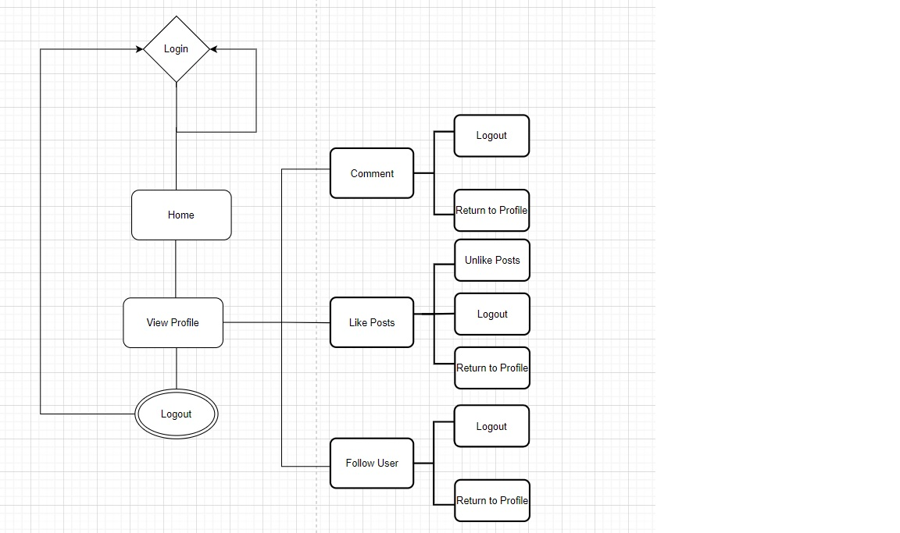
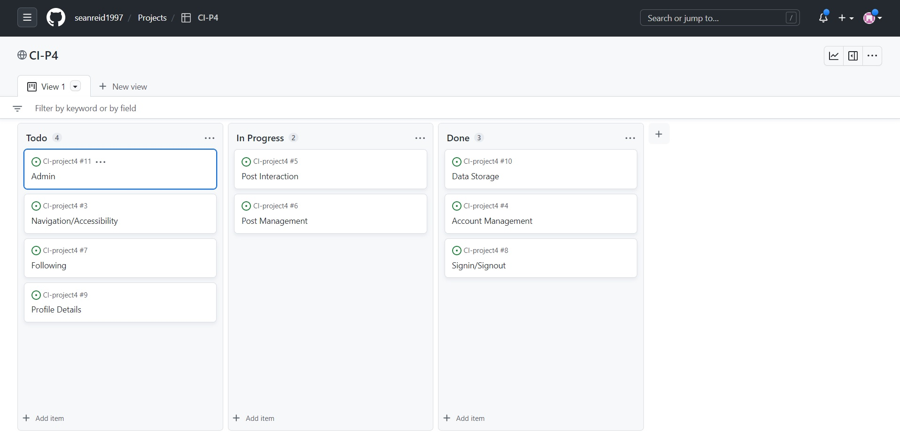

# MyNet

Developer: Sean Reid

<a href="">Live App</a>

## Table of Contents

1. [Project Goals](#project-goals)
    1. [User Goals](#user-goals)
    2. [Site Owner Goals](#site-owner-goals)
2. [User Experience](#user-experience)
    1. [Targeted Audience](#targeted-audience)
    2. [User Requirements and Expectations](#user-requirements-and-expectations)
    3. [User Stories](#user-stories)
3. [Design](#design)
    1. [Flowchart](#flowchart)
    2. [User Manual](#user-manual)
    3. [Agile Methodologies](#agile-methodologies)
    4. [Data Models](#data-models)
4. [Technologies Used](#technologies-used)
    1. [Languages](#languages)
    2. [Frameworks and Tools](#frameworks-and-tools)
    3. [Libraries](#libraries)
5. [Features](#features)
6. [Testing](#validation)
7. [Bugs](#Bugs)
8. [Deployment](#deployment)
9. [Credits](#credits)
10. [Acknowledgements](#acknowledgements)

## Project Goals

### User Goals

<ul>
<li>As</li>
</ul>

### Site Owner Goals

<ul>
<li>I want users to have a good experience.</li>
<li>I want users to be able to create a profile.</li>
<li>I want users to be able to create posts.</li>
<li>I want users to be able to view, like and comment others posts.</li>
<li>I want users to be able to signin/signout of their profiles.</li>
</ul>

## User Experience

### Targeted Audience

<ul>
<li>This app is designed for anyone interested in Social Media.</li>
</ul>

### User Requirements and Expectations

<ul>
<li>Login equired</li>
<li>Program should run without errors</li>
</ul>

## User Stories

### As A First Time User:

1. I would like the site be easily navigatable.
2. I would like to create an account/profile.
3. I want to be able to edit my profile information.
4. I want to be able to create and modify my posts. 
5. I want to be able to follow other users.
6. I want to be able to like other user's posts.
7. I want to be able to comment on other posts.
8. I want to be able to view other users posts.
9. I want to be able to edit my profile information.

### As A Returning User:

10. I want to be able to login/logout of my account.
11. I want my posts and information to be commited to the database to reduce repitition of data entry.
12. I want to be to able contact the administration team if needed.

### As A Site Owner:

13. <li>I want users to have a good experience.</li>
14. <li>I want users to be able to create a profile.</li>
15. <li>I want users to be able to create posts.</li>
16. <li>I want users to be able to view, like and comment others posts.</li>
17. <li>I want users to be able to signin/signout of their profiles.</li>

### Description

## Design

### Flowchart

Flowchart

### User Manual

Overview

#### 
<ul>
<li>User must create an account to access their profile.</li>
<li>Once registered the user can signin/signout of their account.</li>
<li>After the user has signed in/ signed out the will be redirected to the feed page.</li>
<li>While logged in the user will be able to follow the site's navigation.</li>
<li>At the top of the page will be a search bar to search for users and options to manage their account.</li>
<li>At the bottom of the page is where the footer is located. Here you will find the links to other social media platforms.</li>
</ul>

### Agile Methodologies

Screenshot

### Data Model

## Technologies Used

### Languages

<ul>
<li>CSS</li>
<li>Html</li>
<li>Python</li>
</ul>

### Frameworks and Tools

<ul>
<li>Cloudinary</li>
<li>Diagrams.net - used for flowchart.</li>
<li>Django</li>
<li>Git - used for version control within VSCode to push the code to GitHub.</li>
<li>Github - used as a remote repository to store project code.</li>
<li>Gitpod - open source developer platform used for project code.</li>
<li>Google Cloud Platform - used to manage access and permissions to google auth, google sheets, google services, etc.</li>
<li>Google Sheets API - RESTful interface used read and modify project spreadsheet data.</li>
<li>Google Sheets - used to store spreadsheet data.</li>
<li>Heroku - used to deploy project.</li>
<li>PEP8 - used to validate python code.</li>
<li>Visual Studio Code - IDE used to write the code for project.</li>
</ul>

### Libraries

#### Python Libraries

<ul>
<li>os</li>
<li></li>
</ul>

#### 3rd Party Libraries

<ul>
<li>Summernote</li>
</ul>

## Features

### Home Page

<ul>
<li></li>
</ul>

## Testing

### Validation

<ul>

<li>Html code was tested via The W3C Markup Validation Service.</li>

<li>Css code was tested via The W3C CSS Validation Service.</li>

<li>Accessability was tested via The WAVE Web Accessibility Evaluation Tool.</li>

<li>Performance code was tested via The Lighthouse Validation Tool.</li>

<li>Python code was tested via The PEP8 Python Validator.</li>
 

social.admin.py

social.models.py

social.tests.py

social.urls.py

social.views

social_media.settings.py

social.urls.py

social.wsgi.py

</ul>

### Browser Compatibility

The website was tested on the browsers via:
<ul>
<li>Google Chrome</li>
<li>Microsoft Edge</li>
<li>Firefox</li>
</ul>

## User Story Testing

1. I would like the site be tidy with good navigation.

| **Feature** | **Action** | **Expected Result** | **Actual Result** |
|-------------|------------|---------------------|-------------------|
| Site should have easy access | Site Navigation | app should operate effeciently  | Works as expected |

Screenshots

2. I would like to open an account.

| **Feature** | **Action** | **Expected Result** | **Actual Result** |
|-------------|------------|---------------------|-------------------|
|  |  |  |  |

Screenshots

3. I want my posts to have their own unique pages. 

| **Feature** | **Action** | **Expected Result** | **Actual Result** |
|-------------|------------|---------------------|-------------------|
|  |  |  |  |

Screenshots

4. I want to be able to follow other users.

| **Feature** | **Action** | **Expected Result** | **Actual Result** |
|-------------|------------|---------------------|-------------------|
|  |  |  |  |

Screenshots

5. I want to be able to like other posts.

| **Feature** | **Action** | **Expected Result** | **Actual Result** |
|-------------|------------|---------------------|-------------------|
|  |  |  |  |

Screenshots

6. I want to be able to comment on other posts.

| **Feature** | **Action** | **Expected Result** | **Actual Result** |
|-------------|------------|---------------------|-------------------|
|  |  |  |  |

Screenshots

7. I want to be able to view other users posts.

| **Feature** | **Action** | **Expected Result** | **Actual Result** |
|-------------|------------|---------------------|-------------------|
|  |  |  |  |

Screenshots

8. I want to be able to edit my profile information.

| **Feature** | **Action** | **Expected Result** | **Actual Result** |
|-------------|------------|---------------------|-------------------|
|  |  |  |  |

Screenshots

9. I want to be able to login/logout of my account.

| **Feature** | **Action** | **Expected Result** | **Actual Result** |
|-------------|------------|---------------------|-------------------|
|  |  |  |  |

Screenshots

10. I want mhy posts and information to be commited to the database to reduce repitition of data entry.

| **Feature** | **Action** | **Expected Result** | **Actual Result** |
|-------------|------------|---------------------|-------------------|
|  |  |  |  |

Screenshots

11. I want to be to contact the administration team if needed.

| **Feature** | **Action** | **Expected Result** | **Actual Result** |
|-------------|------------|---------------------|-------------------|
|  |  |  |  |

Screenshots

12. 

| **Feature** | **Action** | **Expected Result** | **Actual Result** |
|-------------|------------|---------------------|-------------------|
|  |  |  |  |

Screenshots

13. 

| **Feature** | **Action** | **Expected Result** | **Actual Result** |
|-------------|------------|---------------------|-------------------|
|  |  |  |  |

Screenshots

14. 

| **Feature** | **Action** | **Expected Result** | **Actual Result** |
|-------------|------------|---------------------|-------------------|
|  |  |  |  |

Screenshots

15. 

| **Feature** | **Action** | **Expected Result** | **Actual Result** |
|-------------|------------|---------------------|-------------------|
|  |  |  |  |

Screenshots

16. 

| **Feature** | **Action** | **Expected Result** | **Actual Result** |
|-------------|------------|---------------------|-------------------|
|  |  |  |  |

Screenshots

## Bugs

| **Bugs** | **Fixes** |
| -------- | --------- |
|   |  |
| Upon deployment in Heroku, the following error is displayed "ERROR: Could not build wheels for backports.zoneinfo" | in requirements.txt replace backports.zoneinfo with backports.zoneinfo;python_version<"3.9" |

## Unfixed Bugs
<ul>
<li></li>
</ul>

## Deployment

<ul>
<li>Within the terminal of your workspace enter:"pip3 freeze > requirements.txt".</li>
<li>Create your Procfile and add "web: gunicorn social_media.wsgi".</li>
<li>Before deploying, in settings.py set Debug=True to Debug=False.</li>
<li>Add secret keys to env.py and add env.py to .gitignore file.</li>
<li>Commit and push these changes.</li>
<li>Go to the Heroku website and login/create an account.</li>
<li>Click on the create app button and give it a name. </li>
<li>Select a region and then click on the create app button.</li>
<li>Locate and select the "Settings" tab.</li>
<li>Locate the "Config Vars" button.</li>
<li>Enter the required key and values.</li>
<li>Return to the top and select the "Deploy" tab.</li>
<li>Select "Connect to Github" and then search for you repository.</li>
<li>Next scroll down and select the "Deploy branch" button and wait a few minutes.</li>
<li>Select view and yoiu will be redirected to your app.</li>
</ul>

## Credits

### Code Institute

<ul>
<li>Template used was the Code Institute gitpod full template.</li>
<li>Template for README file was taken from my third projcet.</li>
</ul>

#### Other

<ul>
<li><a href="https://stackoverflow.com/">Stack Overflow</a> provided help on many queries.</li>
</ul>

## Acknowledgements

 <ul>
 <li></li>
 </ul>

 [Return To Top](#MyNet)